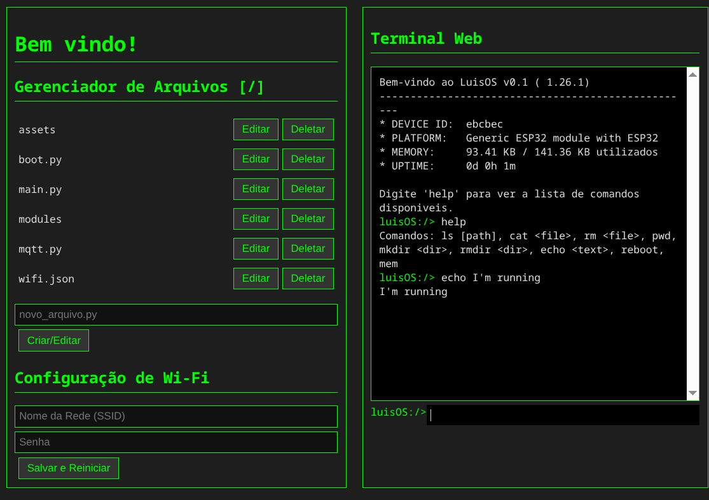
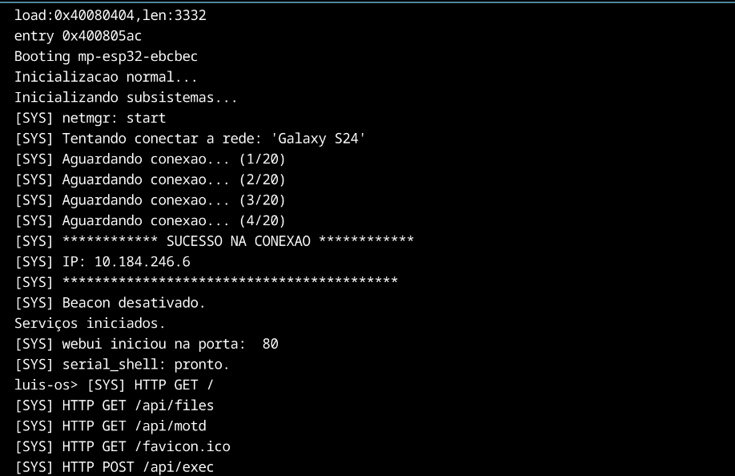

Um SO para ESP32

Este projeto hobista transforma um ESP32 em um dispositivo IoT gerenciável via Wifi, com uma interface web que inclui gerenciador de arquivos e terminal shell serial interativo:

---

----------

STATUS ATUAL - IMPLEMENTADO

Conexao Wi-Fi a redes existentes
Access Point automatico (luisos-AP) quando sem internet
Configuracao de rede via interface web
Terminal web interativo com comandos em tempo real
Gerenciador de arquivos: criar, editar, deletar, listar
MOTD com informacoes do sistema (memoria, uptime, etc)
Configuracao Wi-Fi via navegador
Sistema de Arquivos
Comandos: ls, cat, rm, mkdir, rmdir, echo, pwd - REPEL ls, cat, rm, mkdir, rmdir, echo, mem, gpio reboot
Navegacao entre diretorios
Editor de arquivos integrado
REST files,read,write,delete,exec,motd,gpio{pin},setwifi
GPIO via web: leitura e escrita digital
PWM para controle de intensidade
Leitura analogica (pinos 32-39)
Controle via terminal serial
Acesso via USB com mpremote
Modulos: netmgr, webui, serial_shell, sysctl
Inicializacao automatica de servicos
Gerenciamento assincrono de tarefas

Config:

pip install esptool mpremote
Edite set_wifi.py ou use a interface web
make deploy, deploy-full, repl, ls
ex: http://192.168.4.1
mpremote connect ** ex: /dev/ttyUSB0 repl

Reload on mp :

import machine or main
machine.reset()
main.main()

'''
ROADMAP:

- Fase 1 

Sistema de permissoes de arquivo

Cliente MQTT integrado

Drivers para displays OLED

Configuracao via arquivo JSON

Monitoramento detalhado de recursos

- Fase 2 

Autenticacao web

Gerenciamento de energia (deep sleep)

Sistema de servicos gerenciável

OTA robusto com rollback

- Fase 3 

Dashboard em tempo real

Sistema de pacotes

Cluster de ESP32s

Machine Learning basico

- Fase 4 

Kernel RTOS

Suporte a audio

Jogos simples

High availability

'''