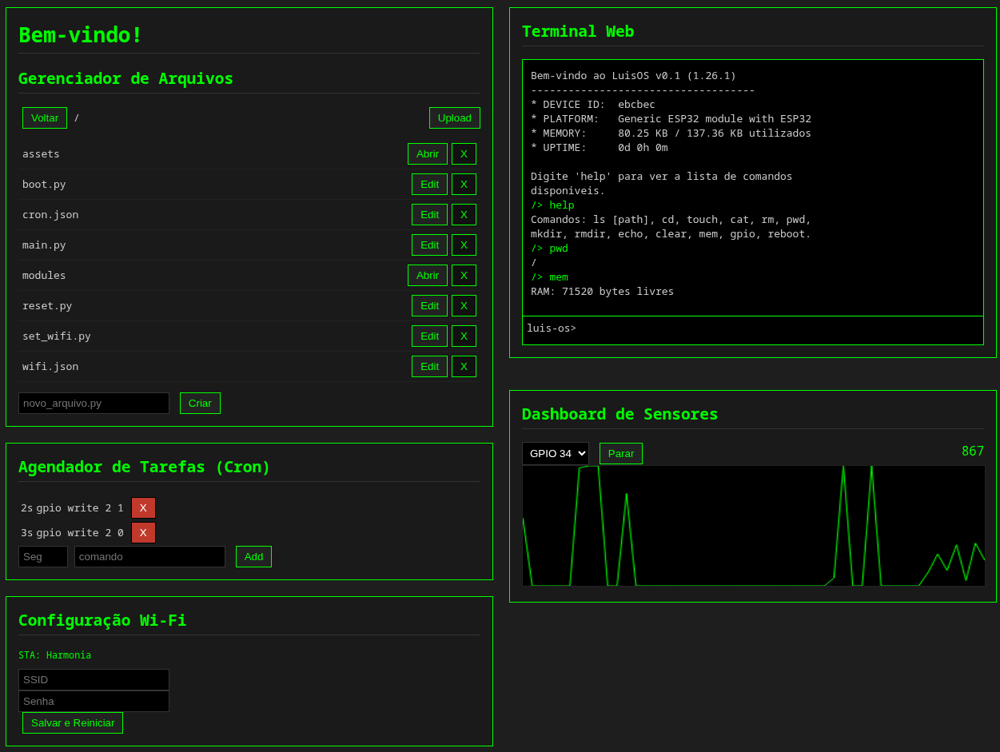
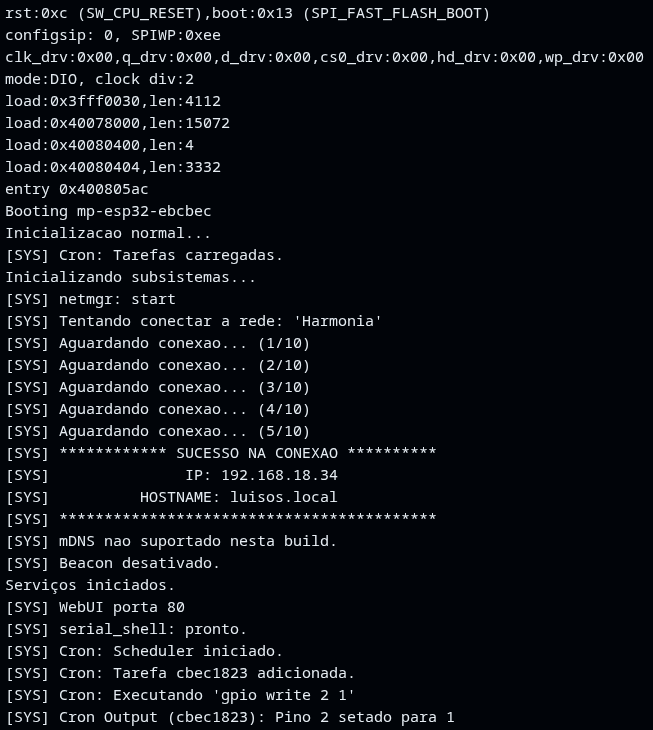

# ESP32-OS

**mPythonOS** é um sistema operacional leve para **ESP32**, focado em **IoT, automacao e controle remoto via Web**.
Ele transforma um ESP32 em um **dispositivo totalmente gerenciavel via Wi-Fi**, com **terminal interativo, sistema de arquivos, API REST, dashboard de sensores e automação de tarefas**, tudo acessivel diretamente pelo navegador.

O projeto roda sobre **RToS** e busca oferecer uma experiencia proxima a um pequeno **Linux embarcado**, adaptado para microcontroladores.

---

# Interface



### Hardware


---

# Funcionalidades

## Rede e Conectividade

- Conexão Wi-Fi a redes existentes
- **Access Point automatico** (`luisos-AP`) quando nenhuma rede é encontrada
- Configuração de rede via interface web
- Suporte a **mDNS**

Acesso via:

http://luisos.local ou http://192.168.4.1 ( Pode variar)


---

# Interface Web

Possui uma **interface web completa** para gerenciamento do dispositivo.

### Recursos

- Terminal interativo em tempo real
- Gerenciador de arquivos
- Editor de arquivos no navegador
- Dashboard de sensores
- Configuração de Wi-Fi
- Controle de GPIO

---

# Dashboard de Sensores (Tempo Real)

Sistema de monitoramento direto pela interface web.

### Recursos

- Plotter grafico **ADC em tempo real**
- Alternância dinâmica entre pinos

GPIO suportados:

32 33 34 35

---

# Terminal Web Interativo

Terminal funcional diretamente no navegador.

### Recursos

- Execução de comandos em tempo real
- Histórico de comandos (com setas )
- Foco automático no input
- Feedback visual de erros

### Comandos disponiveis

ls cat rm mkdir
rmdir echo pwd
cd touch mem
gpio reboot


---

# Sistema de Arquivos

Possui um **gerenciador de arquivos completo** acessível via web ou terminal.

### Operações

- Listar arquivos
- Criar arquivos
- Editar arquivos
- Remover arquivos
- Criar diretórios
- Navegar entre diretórios

---

# Automação (Cron)

Sistema integrado de **agendamento de tarefas**.
Permite executar comandos automaticamente em intervalos definidos.

### Características

- Persistente
- Salvo em:
cron.json

---

# REST

Disponibiliza uma **API HTTP** para integração com outros sistemas.

### Endpoints


/files /read
/write /delete
/exec /motd
/gpio/{pin} /setwifi

---

# Controle de Hardware

### GPIO

Controle digital disponível via:

- Terminal
- API REST
- Interface Web
- PWM
- ADC:
GPIO 32
GPIO 33
GPIO 34
GPIO 35
GPIO 36
GPIO 39

---

# MOTD (System Info)

- Memoria disponível - uptime
- status da rede - versão do sistema

---

### Principais módulos

netmgr.py
webui.py
serial_shell.py
cmd_handler.py
sysctl.py

### Centralização de comandos

cmd_handler.py:

- terminal web
- shell serial
- cron

---

# WebUI

ujson.dumps()
Para tatica corrupção de arquivos editados via web.

---

# Shell Serial

Também pode ser controlado via **USB serial**.
ex: mpremote
- acessar o shell
- enviar arquivos
- executar scripts

---

# Instalação

## Dependências:

```bash
pip install esptool mpremote
Configuração de Wi-Fi

Você pode:

editar o arquivo:

set_wifi.py

ou

configurar pela interface web.

Deploy

Deploy do sistema:

make deploy

Deploy completo:

make deploy-full

Abrir REPL:

make repl

Listar arquivos:

make ls
Acesso ao dispositivo

http://luisos.local ou http://192.168.4.1

Serial:
mpremote connect /dev/ttyUSB0 repl

Via REPL:
import machine
machine.reset()
ou
import main
main.main()
```

###

---
---

**Roadmap**

---
**Fase 1**
- [x] Dashboard de Sensores (Real-time)
- [x] Agendador de Tarefas (Cron)

- [ ] Sistema de permissões de arquivo
- [ ] Cliente MQTT integrado
- [ ] Drivers para displays OLED
- [ ] Monitoramento detalhado de recursos

**Fase 2**
- [ ] Autenticação web
- [ ] Gerenciamento de energia (deep sleep)
- [ ] OTA robusto com rollback

**Fase 3**
- [ ] Dashboard em tempo real avançado
- [ ] Sistema de pacotes
- [ ] Cluster de ESP32
- [ ] Machine Learning básico

**Fase 4**
- [ ] Kernel RTOS dedicado
- [ ] Suporte a áudio
- [ ] Jogos simples
- [ ] High availability
